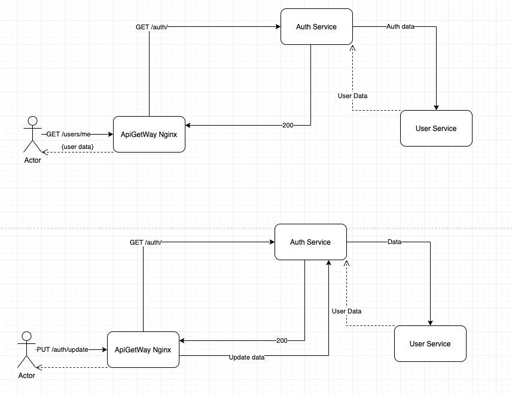
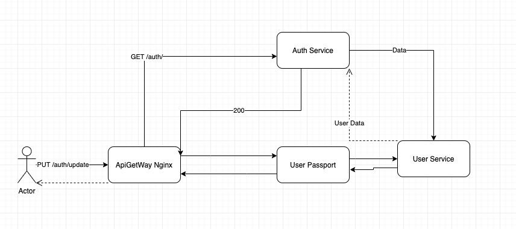

Запуск приложения: 

` skaffold run`
 
 
Описание решения:

- Nginx ходит в сервис аутентификации проверят аутентификацию пользователя
- Сервис аутентификации ходит в сервис пользователей получает данные пользователя для проверки аутентификации 
- для изменения и получения данных пользователя Nginx ходит в сервси аутентификации 

Сервис управления пользователей выделил в отдельную структуру, чтобы с ним можно было работать другим сервисам без авторизации. К примеру забрать какие-то данные пользователя и т.п. 
 
Также должен был появится сервси User Passport, но я не успел его доделать. Этот сервис бы забрал на себя отвественость с сервиса аутентификации по обновлению, получению данных авторизирвоанного пользователя.  
 

Вот примерно так бы это выглядело если бы в системе повяился сервис User Passport

