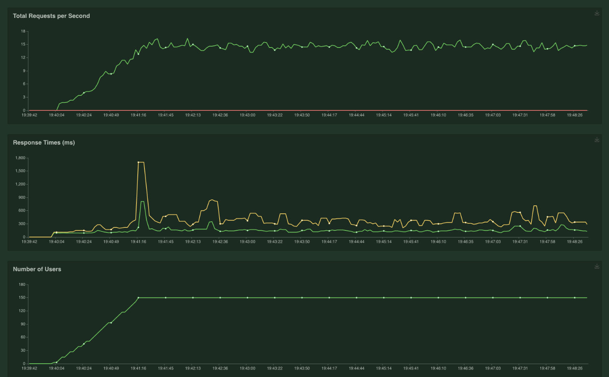

# Вывод

- Узкое место сервиса кодовая база
- Нужно искать методы оптимизации кода сервиса чтобы он лучше держал нагрузку

## Тест 1 (Пустая база, без кеша)

- Кол-во пользователей 150
- Рост кол-ва пользователей 2 в секунду 
- Кеш выключен 
- База данных пустая 

### Отчет

- Сервис отвечает 

## Тест 2 (1900 записей в базе, без кеша)

- Кол-во пользователей 150
- Рост кол-ва пользователей 2 в секунду 
- Кеш выключен 
- База данных имеет 1900 записей 

### Отчет

- Возрасла нагрузка на базу данных
- Мониторинг сервиса перестал отвечать, это плохой сигнал

## Тест 3 (1900 записей в базе, включен кеш)

- Кол-во пользователей 150
- Рост кол-ва пользователей 2 в секунду 
- Кеш включен 
- База данных имеет 1900 записей 

### Отчет

- Мониторинг сервиса перестал отвечать при 3 запросах в секунду, это плохой сигнал
- Нагрузка на базу данных не возрасла, это хороший показатель кеш работает

## Тест 4 краштест (1900 записей в базе, включен кеш)

- Кол-во пользователей 1000
- Рост кол-ва пользователей 10 в секунду 
- Кеш включен 
- База данных имеет 1900 записей 

### Отчет

- Сервис начинает падать при 5 RPS
- 78% процентов запросов завершается неудачей 
- После снижения нагрузки сервис поднимается

